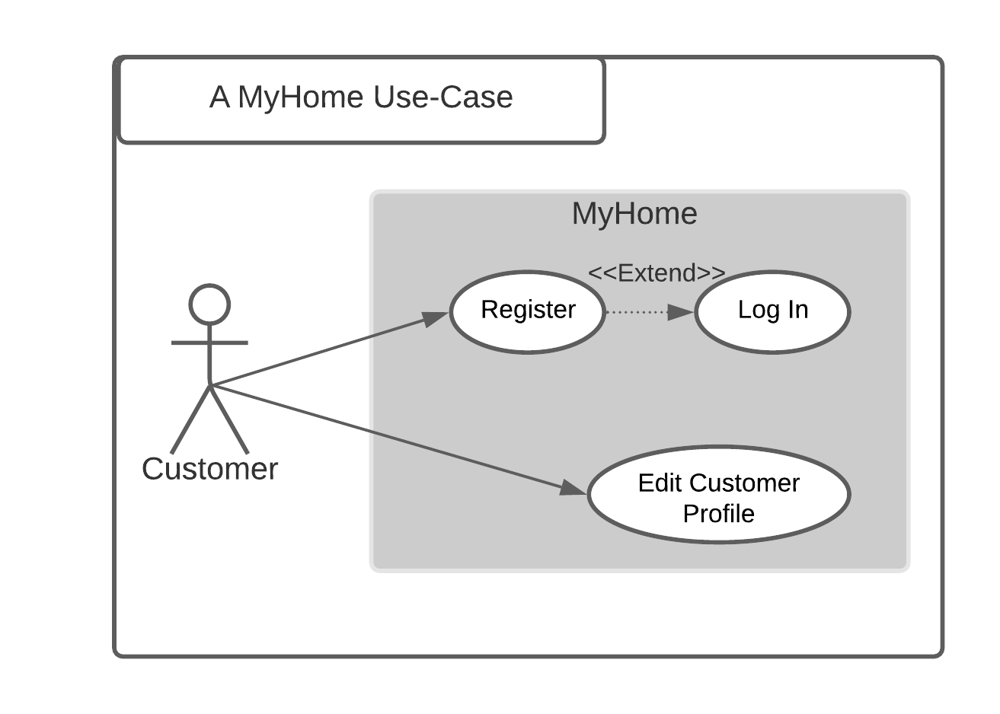

# A MyHome CRM Web App

This is a minimal CRM Web App using the fictive furniture store "MyHome" as a basis. This project was created and developed by:
- Carla Kaufmann
- Flavio Heim
- Leonardo Cepeda Carranza
- Jithin Ureath


[](http://www.apache.org/licenses/LICENSE-2.0.html)
[](https://heroku.com/deploy)


#### Contents:
- [Analysis](#analysis)
  - [Scenario](#scenario)
  - [User Stories](#user-stories)
  - [Use Case](#use-case)
- [Design](#design)
  - [Prototype Design](#prototype-design)
  - [Domain Design](#domain-design)
  - [Business Logic Design](#business-logic-design)
  - [Endpoint Design](#endpoint-design)
- [Implementation](#implementation)
  - [Backend Technology](#backend-technology)
  - [Frontend Technology](#frontend-technology)
- [Deployment](#deployment)
- [User Guide](#user-guide)
- [Project Management](#project-management)
  - [Roles](#roles)
  - [Milestones](#milestones)

## Analysis

### Scenario

As a furnitre store, customers are able to look at our current offerings but also login into their account to be able to make the purchase. All the login and customer related data will be stored in the database.

### User Stories
1.	As a customer, I want to have a simple and easy shopping experience.
2.	As a customer, I would also like to be able to state what I need, e.g. a table and then different recommendations will be suggested to me.
3.	As a customer, I want to create an account so that I can get access to the Web app.
4.	As a customer, I want to log-in so that I can authenticate myself.
5.	As a customer, I want to edit my profile so that my data is stored securely.

### Use Case


- UC-1 [Login on MyHome]: Customers can log-in by entering an email address and password. As an extension, new customers can register first.
- UC-2 [Register on MyHome]: Customers can register to get an account (profile) to access the MyHome system.
- UC-3 [Edit a profile]: Customers can update their profile and change information on it.

## Design

### Prototype Design

A bootstrap based static prototype has been created by using a prototyping application. 

In this case, the prototype application Bootstrap Studio has been used to create a basic user interface design based on an HTML grid, Bootstrap CSS and JavaScript, including the selection of web fonts and font-based icons.

The assets (HTML, CSS, JavaScript, image and font files) has been exported and will be extended in the later during implementation with jQuery, to build a dynamic website.

### Domain Design

The `ch.fhnw.acrm.data.domain` package contains the following domain objects / entities including getters and setters:


### Business Logic Design

The `ch.fhnw.acrm.business.service` package contains classes of the following business services:


### Endpoint Design
**Path**: [`/api/customer`](/api/customer) 

**Method:** `POST`

**Sample Request**  • *Header:* `Content-Type: application/json` • *Body:*

```JSON
{
  "agent": {
    "customers": [
      null
    ],
    "email": "string",
    "id": 0,
    "name": "string",
    "password": "string",
    "remember": "string"
  },
  "email": "string",
  "id": 0,
  "mobile": "string",
  "name": "string"
}
```

• *Optional:* `...`
  
**Success Response**  • *Code:* `200 OK` • *Sample Body:*

```JSON
{
  "agent": {
    "customers": [
      null
    ],
    "email": "string",
    "id": 0,
    "name": "string",
    "password": "string",
    "remember": "string"
  },
  "email": "string",
  "id": 0,
  "mobile": "string",
  "name": "string"
}
```

**Error Response** • *Code:* `404 NOT FOUND`

## Implementation

### Backend Technology
This Web application is relying on [Spring Boot](https://projects.spring.io/spring-boot) and the following dependencies:

- [Spring Boot](https://projects.spring.io/spring-boot)
- [Spring Web](https://docs.spring.io/spring/docs/current/spring-framework-reference/web.html)
- [Spring Data](https://projects.spring.io/spring-data)
- [Java Persistence API (JPA)](http://www.oracle.com/technetwork/java/javaee/tech/persistence-jsp-140049.html)
- [H2 Database Engine](https://www.h2database.com)
- [PostgreSQL](https://www.postgresql.org)

To bootstrap the application, the [Spring Initializr](https://start.spring.io/) has been used.

Then the following further dependencies has been added to the project `pom.xml`:

- Swagger and Swagger UI:
```XML
<dependency>
    <groupId>io.springfox</groupId>
    <artifactId>springfox-boot-starter</artifactId>
    <version>3.0.0</version>
</dependency>
```

- Java HTML Parser and JWT:
```XML
<dependency>
    <groupId>org.jsoup</groupId>
    <artifactId>jsoup</artifactId>
    <version>1.14.2</version>
</dependency>
<dependency>
    <groupId>io.jsonwebtoken</groupId>
    <artifactId>jjwt-api</artifactId>
    <version>0.11.2</version>
</dependency>
<dependency>
    <groupId>io.jsonwebtoken</groupId>
    <artifactId>jjwt-impl</artifactId>
    <version>0.11.2</version>
    <scope>runtime</scope>
</dependency>
<dependency>
    <groupId>io.jsonwebtoken</groupId>
    <artifactId>jjwt-gson</artifactId>
    <version>0.11.2</version>
    <scope>runtime</scope>
</dependency>
```

### Frontend Technology
This Web application is relying on the following frontend technology/libraries:

- jQuery
- Bootstrap

## Deployment
This spring boot has been deployed to Heroku by using a pre-configuration scripts `app.json` and `Procfile`.

## User Guide
The Web application can be accessed over the browser by using the following address: `https://***.herokuapp.com/`. And the Swagger-UI can be access using the specific page: `https://***.herokuapp.com/swagger-ui/`.

## Project Management

### Roles
- All-rounder: [Carla Kaufmann](https://www.linkedin.com/in/carla-kaufmann-371167154/)
- Database Developer: [Flavio Heim]
- Website Developer: [Leonardo Cepeda Carranza]
- Business Analyst: [Jithin Ureath](https://ch.linkedin.com/in/jithin-ureath-10340b1a6)

### Milestones
1. **Analysis**: Scenario ideation, use case analysis and user story writing.
2. **Prototype Design**: Creation of Bootstrap static web-design prototype.
3. **Domain Design**: Definition of domain model.
4. **Business Logic and API Design**: Definition of business logic and API.
5. **Data and API Implementation**: Implementation of data access and business logic layers, and API.
6. **Security and Frontend Implementation**: Integration of security framework and frontend realisation.
7. **Deployment**: Deployment of Web application on cloud infrastructure.

#### Maintainer
- [Andreas Martin](https://andreasmartin.ch)

#### License
- [Apache License, Version 2.0](blob/master/LICENSE)

## Authors

- [@katherinepeterson](https://www.github.com/octokatherine)

